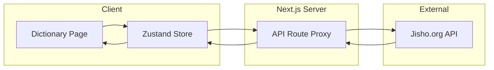

# Tích hợp từ điển JMdict/EDICT với Jisho API

## Tổng quan kiến trúc



## Lý do dùng API Route làm proxy

Jisho API không hỗ trợ CORS nên phải proxy qua Next.js API Route. Đồng thời giúp:

- Kiểm soát rate limiting
- Cache server-side nếu cần
- Ẩn logic gọi API với client

## Cấu trúc files cần tạo

```
features/Dictionary/
  components/
    DictionaryPage.tsx      # Trang chính
    SearchBar.tsx           # Thanh tìm kiếm
    SearchResults.tsx       # Danh sách kết quả
    WordCard.tsx            # Card hiển thị từ
    WordDetail.tsx          # Chi tiết từ (popup/modal)
    FilterBar.tsx           # Filter JLPT, từ loại
  services/
    jishoService.ts         # Gọi API
  store/
    useDictionaryStore.ts   # State management
  types/
    dictionary.ts           # TypeScript interfaces

app/[locale]/dictionary/
  page.tsx                  # Route page
  loading.tsx               # Loading skeleton

app/api/dictionary/
  route.ts                  # API proxy cho Jisho
```

## Chi tiết implementation

### 1. API Proxy Route

File: `app/api/dictionary/route.ts`

```typescript
// Proxy request tới Jisho API để tránh CORS
// GET /api/dictionary?keyword=...&page=1
export async function GET(request: Request) {
  const { searchParams } = new URL(request.url);
  const keyword = searchParams.get('keyword');
  const page = searchParams.get('page') || '1';
  
  const response = await fetch(
    `https://jisho.org/api/v1/search/words?keyword=${encodeURIComponent(keyword)}&page=${page}`
  );
  return Response.json(await response.json());
}
```

### 2. Jisho API Response Structure

Jisho trả về format như sau (quan trọng cho việc định nghĩa types):

```typescript
interface JishoWord {
  slug: string;
  japanese: Array<{
    word?: string;      // Kanji
    reading: string;    // Hiragana
  }>;
  senses: Array<{
    english_definitions: string[];
    parts_of_speech: string[];
    tags: string[];     // Chứa "jlpt-n5", "jlpt-n4"...
  }>;
  jlpt: string[];       // ["jlpt-n5"]
  is_common: boolean;
}
```

### 3. Zustand Store

File: `features/Dictionary/store/useDictionaryStore.ts`

Quản lý:

- `searchQuery`: Từ khóa tìm kiếm
- `results`: Kết quả từ API
- `isLoading`: Trạng thái loading
- `filters`: JLPT level, từ loại
- `searchHistory`: Lịch sử tìm kiếm (lưu localStorage)
- `selectedWord`: Từ đang xem chi tiết

### 4. UI Components

**SearchBar**: Input với debounce 300ms, hỗ trợ cả romaji/hiragana/kanji

**FilterBar**:

- JLPT: N5, N4, N3, N2, N1, All
- Từ loại: Noun, Verb, Adjective, Adverb, All
- Common words only toggle

**WordCard**: Hiển thị compact

- Kanji + reading (furigana)
- Nghĩa chính (1-2 định nghĩa đầu)
- Tags: JLPT level, common word badge

**WordDetail**: Modal chi tiết

- Tất cả readings
- Tất cả definitions theo từ loại
- Examples (nếu có)
- Button phát âm (dùng TTS hiện có)

## Tích hợp i18n

Thêm translations vào các file locale:

- `core/i18n/messages/en.json`
- `core/i18n/messages/vi.json`
- ...các ngôn ngữ khác

## Lưu ý quan trọng

1. **Rate limiting**: Jisho không document rate limit, nên implement debounce và cache kết quả trong store
2. **Offline**: API approach không hỗ trợ offline, cân nhắc cache với localforage nếu cần
3. **Wanakana**: Dự án đã có `wanakana` - dùng để convert romaji sang hiragana trong search